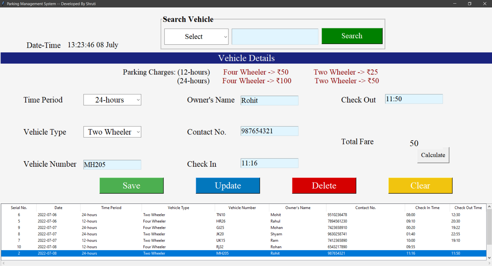

# Parking-Management-System
It is the Tkinter- Python GUI based software  where a person can manage the parking activity digitally.

In this GUI software, a person can add the visitor details such as vehicle number, vehicle type,
owner's name, time format, also it will show the calculated amount of the total fare on the basis of
vehicle type and time format (12 hours or 24 hours) 

That data will store in a database and display the data in below out table. 
There is a search option also so- if that person wants to update the check-out time 
of that vehicle then the person searches that vehicle by using its vehicle number, owner's name and contact number. 

Here is the outlook of that software:
https://github.com/shru2408/Parking-Management-System/blob/edef264023409a41f4f50b2069a31317e46bf69a/Outlook%20of%20PMS.png

